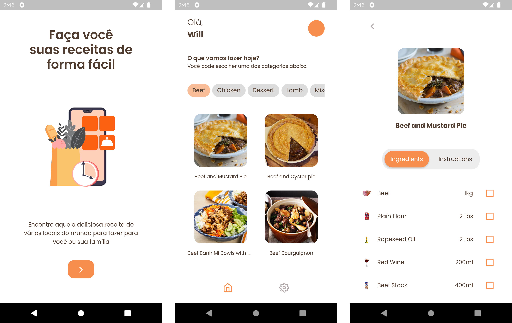

<br>
  <center>
    
  </center>
<br>

##

O Cooking Home, é um aplicativo para você que gosta de cozinhar, ou simplesmente, quer tentar aquela receita deliciosa para você e sua família. Com uma interface simples e intuitiva você pode ver várias receitas que ficam organizadas por categorias (assim pode ir direto ao ponto), e também consegue ver quais os ingredientes necessários para o preparo, e claro, o modo de fazer, pra sua receita sair incrível.

## Índice

- **[Protótipo](#protótipo)**
- **[Recursos do App](#O-que-você-vai-encontrar-no-app?)**
- **[Tecnologias](#Tecnologias-e-Recursos-Utilizados)**
- **[Roadmap](#Possibilidades-de-melhorias-e-novos-recursos)**
- **[Como Executar](#Como-Executar)**
- **[Executar Testes Unitários](#Executar-testes-unitários)**
- **[Demonstração do App](#Demonstração-do-App)**

## Protótipo

Inicialmente foi implementado um esboço e protótipo de como seria o aplicativo, você pode criar uma cópia para a sua conta no Figma, [só acessar aqui](https://www.figma.com/file/yJkHkN9hgP6Xm14Rwoa5vn/Cooking-Home?node-id=0%3A1).

## O que você vai encontrar no app?

- Visualizar todas as categorias de receitas
- Ver todas as receitas de determinada categoria
- Ver os detalhes de uma receita, com ingredientes e modo de fazer
- Possibilidade de alternar entre Modo Escuro e Claro

## Tecnologias e Recursos Utilizados

- Gerenciamento de estados com MobX
- Testes unitários
- Uso de Lottie para animações com arquivos JSON
- Efeito de carregamento Shimmer
- Consumo da [API The Meal DB](https://www.themealdb.com/)
- Fluxo de CI com Github Actions

## Possibilidades de melhorias e novos recursos

- Salvar configuração de dark mode

Atualmente o aplicativo já suporta a mudança de dark mode e light mode, com isso
podemos implementar em versões futuras o salvamento dessa configuração banco de dados local,
para isso existe algumas opções como o [Shared Preferences](https://pub.dev/packages/shared_preferences) e o [Hive](https://pub.dev/packages/hive).

- Intercionalização

É possível também adicionarmos uma configuração para lidar com vários idiomas no aplicativo, e já aproveitando o uso
de um banco de dados local para salvar todas as preferências necessárias para quem for usar a aplicação.

- Salvar receitas favoritas

Essa é também uma funcionalidade que pode trazer muito valor para as pessoas que forem usar o aplicativo, como existem
muitas opções de receitas, às vezes queremos manter aquela especial bem perto. Então, podemos usar mais uma vez dos
recursos de armazenamento local e implementar a funcionalidade.

## Como Executar

1. Primeiramente, você precisa SDK do Flutter instalado para prosegguir, Siga os passos na documentação oficial [aqui](https://docs.flutter.dev/get-started/install).

2. Depois de instalado, é só seguir os passos abaixo:

```bash
## Clone esse repositório em algum local
$ git clone https://github.com/WillACosta/cooking_app_challenge

## Navegue até o diretório raiz
$ cd cooking_app_challenge

## Instale as dependências do projeto
$ flutter pub get

## Em uma janela do terminal execute o comando para rodar a aplicação
$ flutter run
```

### Executar testes unitários

É bem simples, basta executar o seguinte comando no terminal

```shell
flutter test
```

---

Made with 🖤 by Will
